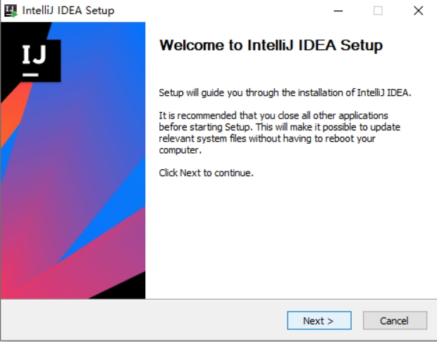
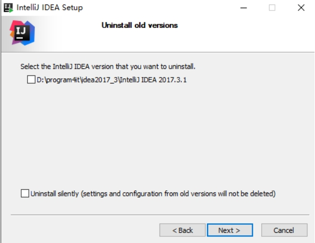
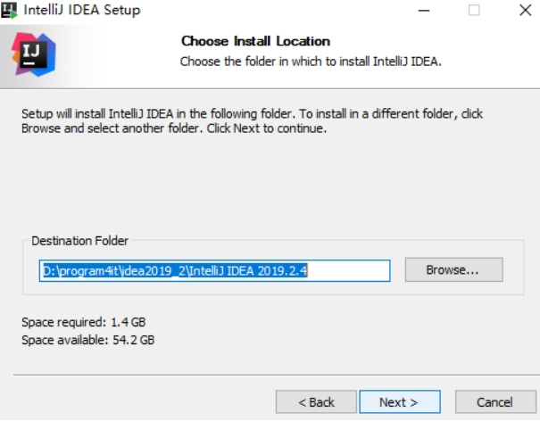
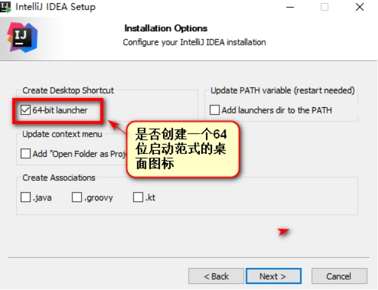
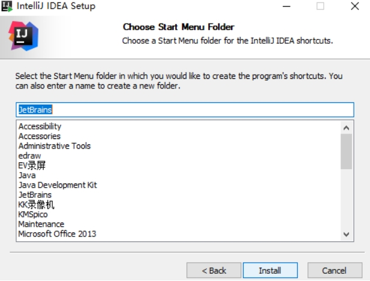
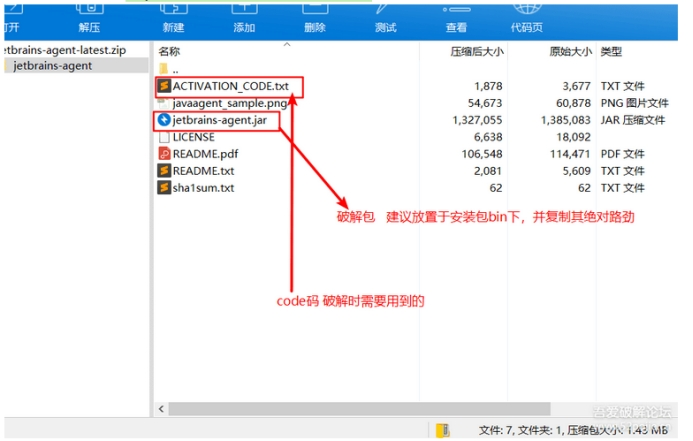
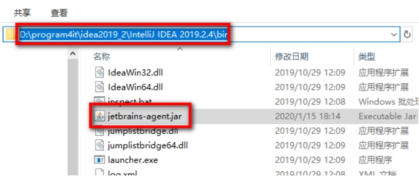
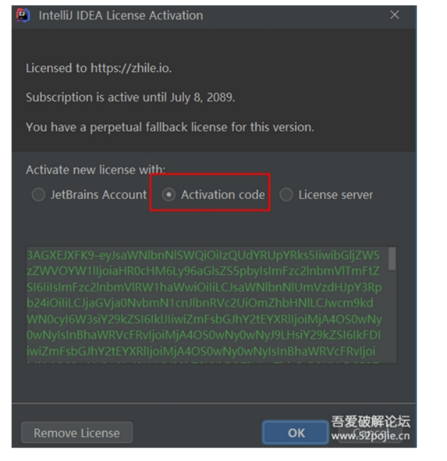

# IDEA-win
# IDEA2019.2.4

## 1. 安装idea，
>官网的即可 https://download.jetbrains.com/idea/ideaIU-2019.2.4.exe 下载完成后 双击安装
>文件 开始安装

 

 

 

提示我们 是否卸载电脑上已经安装的其他版本的idea  直接next 

 

手动选择安装位置

 

## 创建桌面图标

 

Install 安装

 

 

## 破解idea

 

 

 

> 将破解包放置某个地方，复制绝对路劲，本人还是以前一样放置于安装目录/bin （地址自己清楚即可个人建议）




编辑  `idea64.exe.vmoptions` 最后一行添加 

> -javaagent:D:\program4it\idea2019_2\IntelliJ IDEA 2019.2.4\bin\jetbrains-agent.jar 
></br>
>红色部分为你电脑上安装idea的路径  蓝色部分是破解文件的名字

和以前的一样了打开 idea 配置请选择 Activation Code 将破解包中 Activation_Code内的码复制到文本框即可

 

 


</br></br></br></br></br></br></br></br></br></br>
</br></br></br></br></br></br></br></br></br></br>
</br></br></br></br></br></br></br></br></br></br>


# IDEA_2021.3.2


## 第一步: 下载最新的 IDEA 2021.3.2 版本安装包

我们先从 IDEA 官网下载 IDEA 2021.3.2 版本的安装包，下载链接如下：

https://www.jetbrains.com/idea/download/


点击下载，静心等待其下载完毕即可。


## 第二步: 先卸载老版本的 IDEA

> 注意，如果电脑上之前有安装老版本的 IDEA, 需要先卸载干净，否则可能安装失败！
>
> 注意，一定要先卸载干净掉老版本的 IDEA。

1.笔者之前安装了老版本的 IDEA, 所以要先卸载，未安装老版本 IDEA 的小伙伴直接跳过，直接看后面激活步骤就行:


卸载成功后，点击关闭:


卸载成功后，双击刚刚下载好的 `idea` exe 格式安装包, 打开它；


## 第三步: 开始安装 IDEA 2021.3.2 版本

2.安装目录默认为 `C:\Program Files\JetBrains\IntelliJ IDEA 2021.3.2`, 这里笔者选择的是默认路径:


3.勾选创建桌面快捷方式，这边方便后续打开 IDEA：


4.点击 `Install` ：


 

 5.安装完成后，勾选 `Run IntelliJ IDEA`，点击 `Finish` 运行软件:


 IDEA 运行成功后，会弹出下面的对话框，提示我们需要先登录 JetBrains 账户才能使用：

 

 

 

 

 

5.安装完成后，勾选 `Run IntelliJ IDEA`，点击 `Finish` 运行软件:


IDEA 运行成功后，会弹出下面的对话框，提示我们需要先登录 JetBrains 账户才能使用：


这里我们先不管，先点击 `Exit` 退出，准备开始运行激活脚本。


## 第四步：清空 IDEA 以前使用过的激活方式【非常重要】

> ​	**运行激活脚本之前，如果你之前安装过 IDEA, 且手动为 IDEA 修改过 hosts 文件，那么添加的配置，记得要删除；引用过的补丁也要移除掉等, 不然可能会与本文提供的补丁有冲突，出现各种奇奇怪怪的问题。**

**如果没有动过 hosts 文件，则不用管，继续走下面的步骤。**


## 第五步：开始激活

### 下载激活脚本

先通过网盘下载好激活补丁，打开文件夹如下：

> **注意：激活脚本文末获取！**


可以看到，相比较激活补丁之前的版本，新版本补丁z大新加了两个文件夹：

- ```
    scripts
    ```

    : 放置了相关脚本，包含自动安装、卸载破解补丁脚本（Windows、Mac、Linux 对应系统的脚本都有）；

    > 之前的 IDEA 版本，我们都是手动在 `idea.vmoptions` 配置文件引入破解补丁，但是有部分小伙伴反映找不到 `idea.vmoptions` 文件，这次，通过运行脚本可以直接引入补丁，针对小白，方便了很多。

- `vmoptions`： 放置了 JetBrains 产品的 `idea.vmoptions` 配置文件。之前版本都是通过在这个文件中手动引入破解补丁，但是最新版本 IDEA 2021.3.2 官方加入了反制手段，在用户目录下已经找不到这个文件了，新版本我们直接引用这个文件夹下的 `idea.vmoptions` 配置文件；

### 运行激活脚本

将 `ja-netfilter-all`激活文件夹移动到电脑上某个位置，笔者做演示放置在了桌面上，你可以放到 `D` 盘或者其他路径下：


Windows 系统，点击运行 `install-current-user.vbs` 脚本，为当前用户安装破解补丁。

Mac/Linux 系统，点击运行 `install.sh` 脚本安装。

> PS: `install-all-users.vbs` 为系统所有用户安装，不太推荐。`unistall-*`前缀的是卸载补丁脚本。

点击安装，会弹出如下提示：


告诉我们，运行此补丁大约花费几秒钟，点击 `确定`，等待 `Done` 完成提示框出现，到这里，表示补丁安装成功。


> 大致看下，代码主要是为 JetBrains 系列产品在外置 `.vmoptions` 配置文件中引用破解补丁：
>
> 
>
> 以及添加`idea.vmoptions` 文件的环境变量，脚本运行成功后，打开环境变量看下，如下：
>
> 
>
> 
>
> 可以看到，除了为 IDEA 添加 `.vmoptions` 环境变量外，还有其他产品的，如 Goland 等。
>
> 所以，小伙伴们不用担心是木马啥的，安心运行等待安装成功就行。


## 第六步：打开 IDEA, 填入指定激活码完成激活

运行脚本安装破解补丁完成后，**一定要重启 IDEA**，然后，填入下面的激活码，点击激活即可。

（激活码也可以通过 [这个站点 ](http://www.itmind.net/11881.html)重新获取）


（激活码也可以通过 [这个站点 ](http://www.itmind.net/11881.html)重新获取）

 

复制激活码后填入，点击 `Activate` 按钮完成激活：

.jpg)