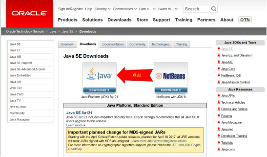
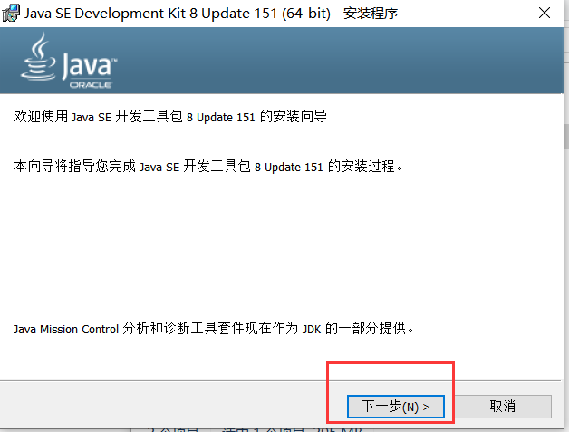
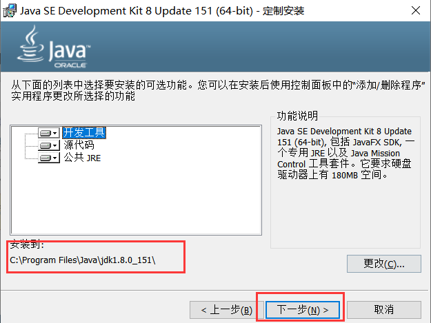
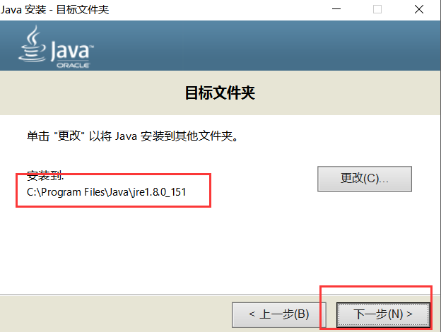
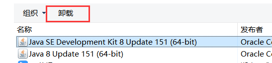
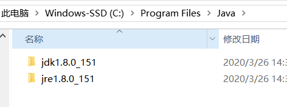
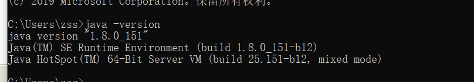
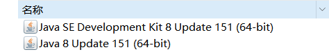

【1】下载JDK

www.oracle.com/technetwork/java/javase/downloads/index.html

 

【2】安装JDK

【3】卸载JDK

控制面板卸载即可

【4】 验证JDK是否安装成功

（1）方式1：去安装目录下看一眼：

（2）方式2：通过控制命令台查看：

（3）方式3：通过控制面板查看：

【5】JDK和JRE：

JDK： Java Development kit   ---->编写Java程序的程序员使用的软件

JRE : Java Runtime Enviroment  ----》运行Java程序的用户使用的软件

