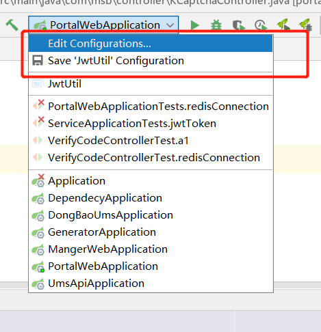
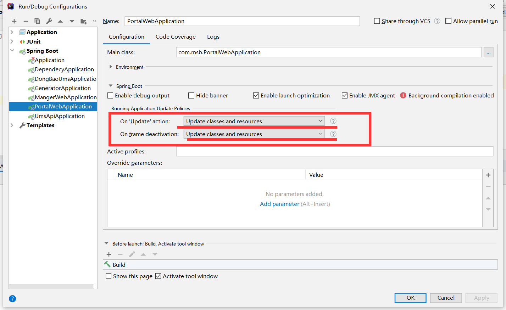
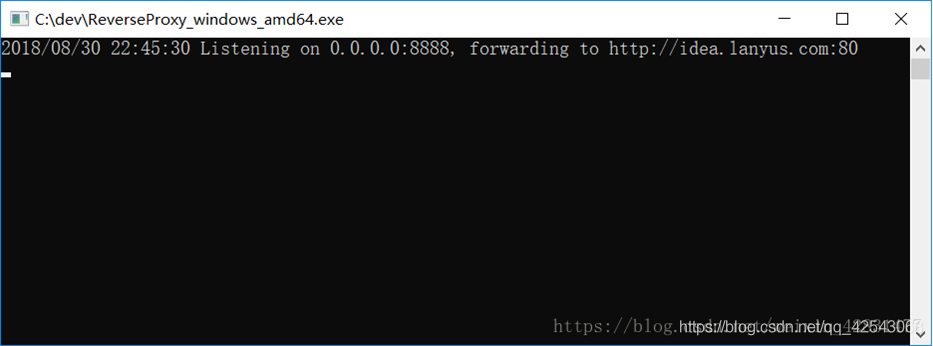
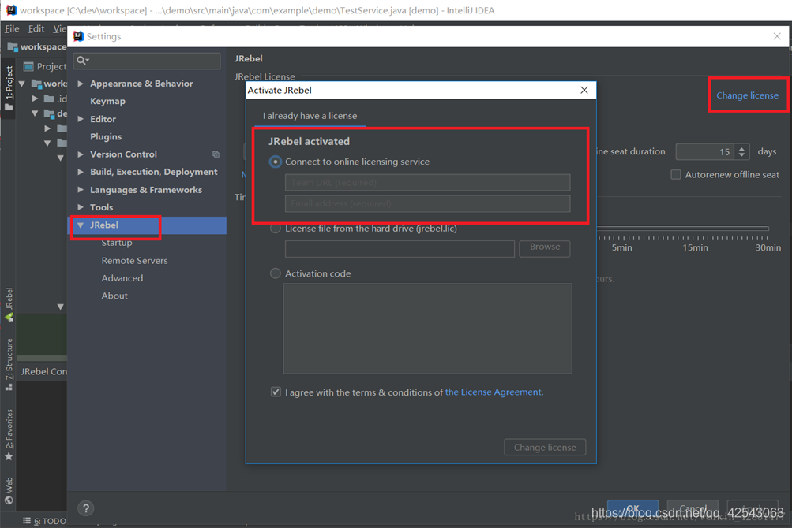
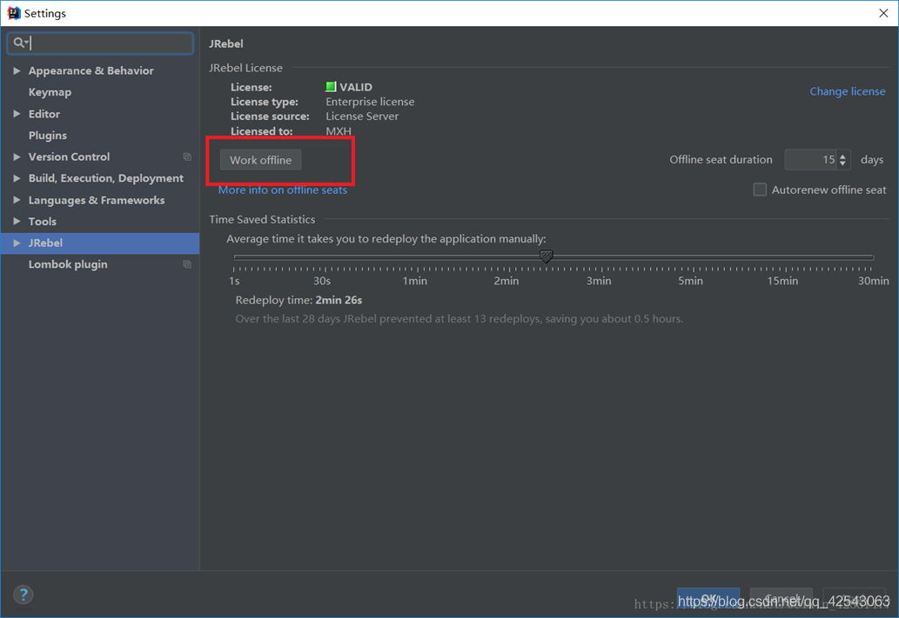
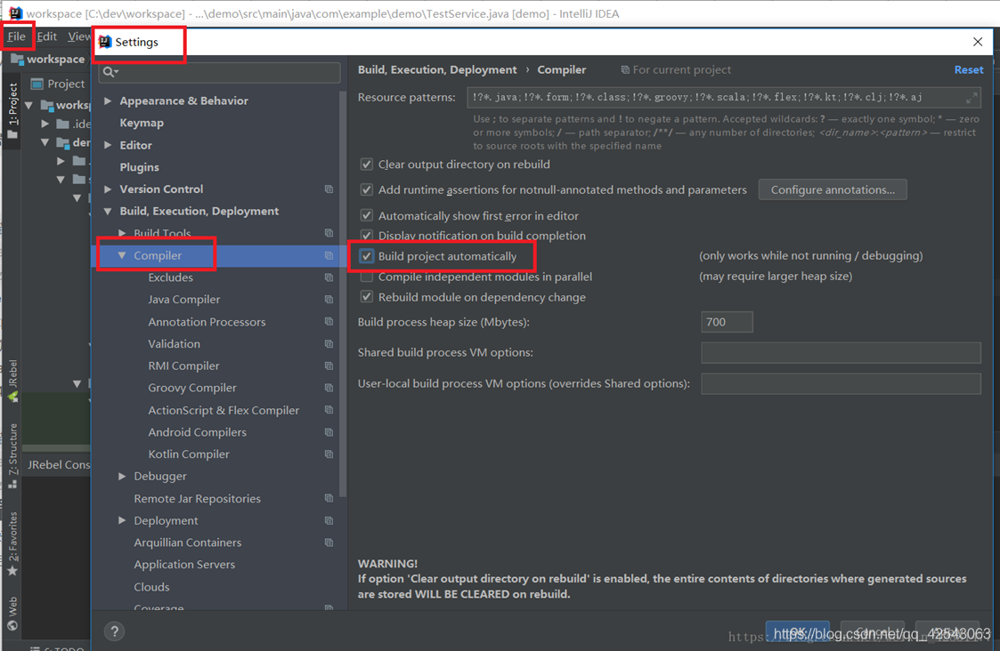
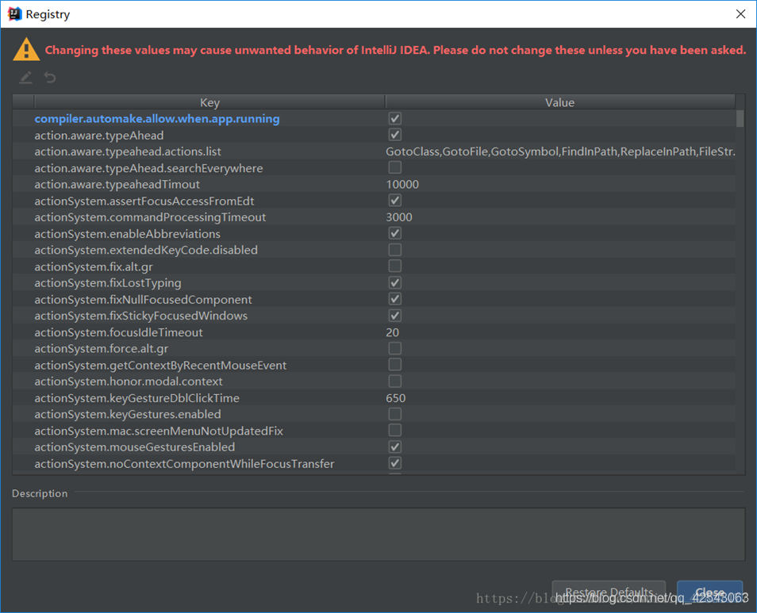
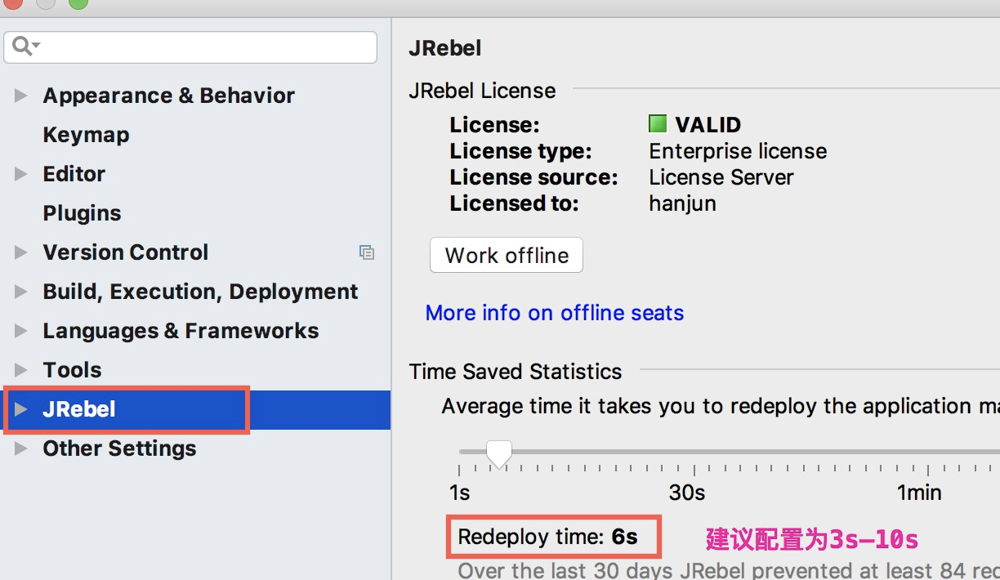
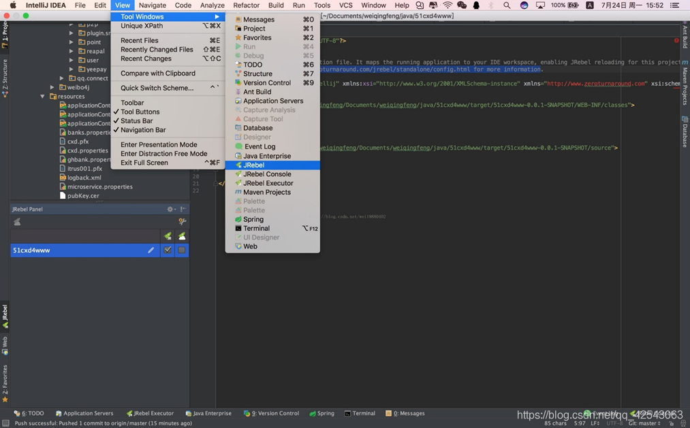
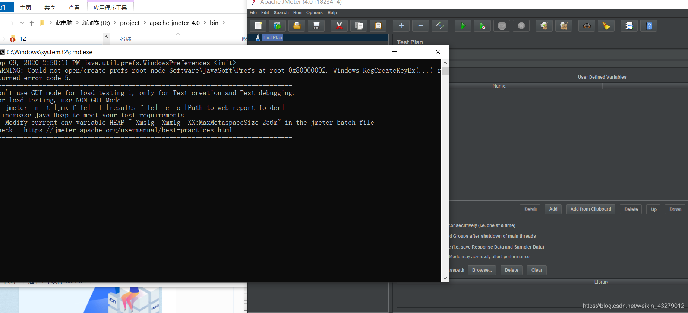

# JRebel-热部署

**注：要修改编辑器配置信息**

## 1）首先安装正版插件

​		直接下载不行可以使用离线下载，下载完成之后直接将安装包拖入到 idea 重启 

**注**：安装的时候一定要注意版本适应问题  **看清楚**

## 2）二 , 启动Jrebel

​	JRebel并非"白饭"的工具，需要经过"一番操作"之后才能使用。

​	此时需要一个""反""向""代""里""软件 ,  可根据需求更改版本(笔者使用的windows64 )

​	""反""向""代""里""下载地址: 

https://github.com/ilanyu/ReverseProxy/releases/tag/v1.4 

​	可根据需求更改版本(手顺所提供为 windows64 )

弄好之后双击运行我们下载的""反""向""代""里""程序

**打开之后不要关闭**

在IDEA中一次点击 File->Settings->JRebel 并找到""l"""启,,(ji),,用,,(huo)""l"""界面

## 3)开始注册    （active）

 

选择JRebel activated中的 connect to online licensing service 	 	

**注：**

后面的是GUID ，以下两个网址都可在线生成

https://www.guidgen.com/

http://www.ofmonkey.com/transfer/guid

**第一行输入**   http://127.0.0.1:8888/  + GUID

实例： http://127.0.0.1:8888/d3545f42-7b88-4a77-a2da-5242c46d4bc2 

**第二行输入正确的邮箱格式**	 	 	 	

 	 	 

再点击以下change liense 按钮验证""l"""启,,(ji),,用,,(huo)""l"""  有些不是 change linese  	 	 

点击 work offline

## 4)相关设置 :

[启动之前 要修改 edit Config](#JRebel注)

### 1、设置项目自动编译

### 2、设置 compiler.automake.allow.when.app.running

ctrl+shift+A 或者 help->find action…打开 	 	 	 	 	 
搜索registry 	 	 	 	 	 	 	 	 	 	 
找到 compiler.automake.allow.when.app.running 并✔ 	 	

 	 	

### 3、配置rebel 的监控时间间隔/加载频率

   

### 4、view ->tool windows ->jrebel,在需要热部署的项目上选中，。

这时候会在你的跟目录中生成一个rebel.xml文件，这个是jrebel的配置文件，需要是配置jrebel的监听目录的

  

**注：[启动之前 要修改 edit Config](#JRebel注)**

## JMete安装

很详细的教程： https://blog.csdn.net/weixin_43279012/article/details/108490036 

 **启动Jmeter**

		>	​	找到Jmeter解压路径（D:\apache-jmeter-4.0\bin）下  **jmeter.bat**    文件，双击，并且在提示框点击”运行“，此时会弹出两个界面，一个是命令窗口，一个是JMeter窗口，意味着JMeter已经安装成功了。

 

