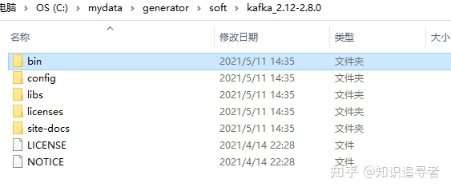
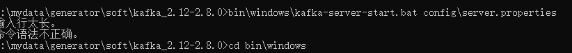
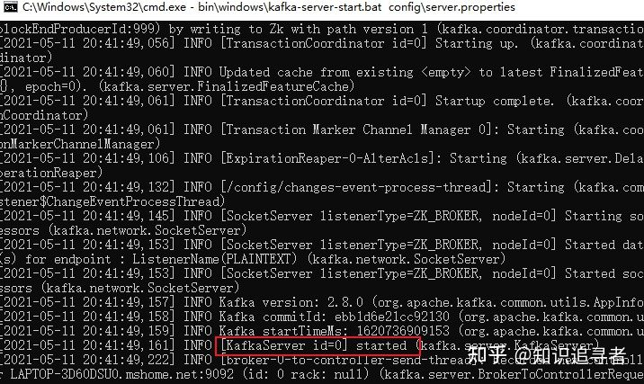

# Kafka安装

​	kafka 的安装包其实没有分window 还是 linux, 所以下载的安装包还是之前的安装包，直接解压出来即可；





启动Zookeeper 服务端命令

```text
./bin\windows\zookeeper-server-start.bat  ./config\zookeeper.properties 
```

这边会报一个奇葩的错误，命令行太长，直接将压缩包解压到根目录或者桌面进行操作





启动成功


启动kafka服务端命令

```text
 ./bin\windows\kafka-server-start.bat  ./config\server.properties
```

启动成功




