# MySQL安装

## 【1】MySQL的版本：

近期主要历史版本有5.0/5.1/5.5/5.6/5.7，目前最新版本是MySQL8。6.0曾经是个内部试验版本，已取消了。

MySQL8.0的版本历史
1) 2016-09-12第一个DM(development milestone)版本8.0.0发布
2) 2018-04-19第一个GA(General Availability)版本开始，8.0.11发布
3) 2018-07-27 8.0.12GA发布
4) 2018-10-22 8.0.13GA发布
5) 2019-01-21 8.0.14GA发布
6) 2019-02-01 8.0.15GA发布
7) 最新的版本是8.0.18,2019年10月14日正式发布
8) ....后续更新

## 【2】官方下载地址：

https://dev.mysql.com/downloads/windows/installer/8.0.html

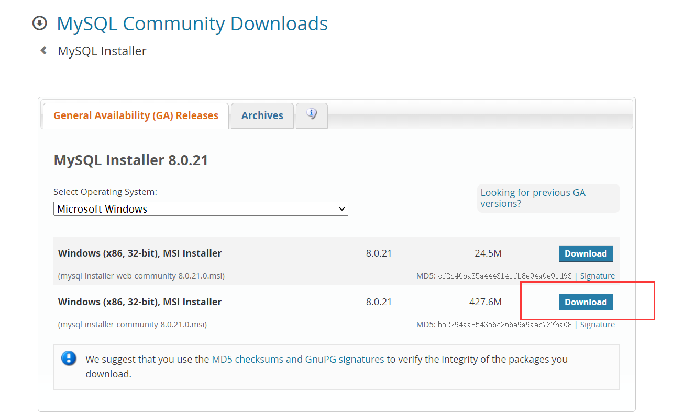


## 【3】安装过程：

**1.双击MySQL安装文件mysql-installer-community-8.0.18.0.msi，出现安装类型选项。**

* Developer Default：开发者默认

* Server only：只安装服务器端 

* Client only：只安装客户端

* Full：安装全部选项
* Custom：自定义安装

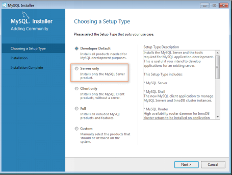

**2.选择，然后继续：**

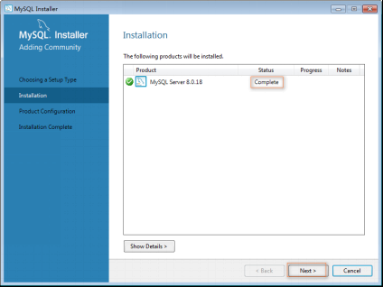

**3.进入产品配置向导，配置多个安装细节，点击Next按钮即可。**

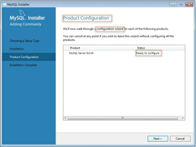

**4.高可靠性High Availability，采用默认选项即可。**

* Standalone MySQL Server/Classic MySQL Replication:独立MySQL服务器/经典MySQL复制

* InnoDB Cluster:InnoDB集群

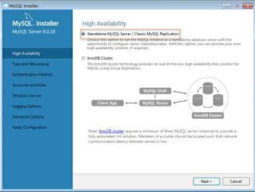

**5.类型和网络 Type and Networking，采用默认选项即可。记住MySQL的监听端口默认是3306。**

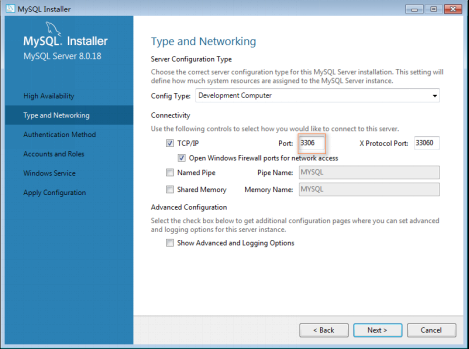

**6.身份验证方法Authentication Method，采用默认选项即可。**

 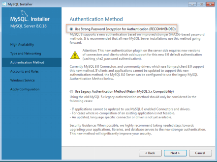

**7.账户和角色 Accounts and Roles。MySQL管理员账户名称是root，在此处指定root用户的密码。还可以在此处通过Add User按钮添加其他新账户，此处省略该操作。**

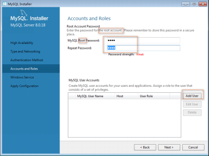

**8.Windows服务：Windows Service。**

* Configure MySQL Server as a Windows Service:给MySQL服务器配置一个服务项。

* Windows Service Name:服务名称，采用默认名称MySQL80即可。

* Start the MySQL at System Startup：系统启动时开启MySQL服务


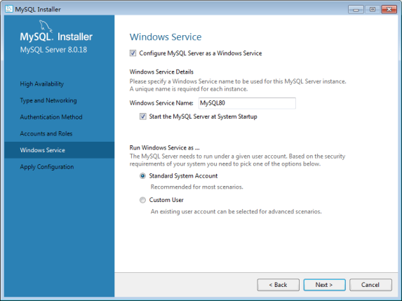


 

**9.Apply Configuration：点击Execute按钮执行开始应用这些配置项。**

* Writing configuration file: 写配置文件。

* Updating Windows Firewall rules：更新Windows防火墙规则

* Adjusting Windows services：调整Windows服务

* Initializing database：初始化数据库

* Starting the server： 启动服务器

* Applying security setting：应用安全设置

* Updating the Start menu link：更新开始菜单快捷方式链接


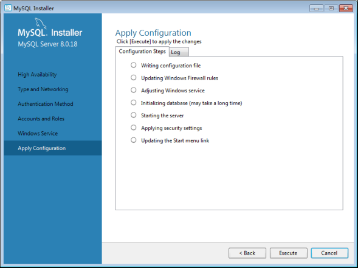

**PS：如果配置出错，查看右侧的log，查看对应错误信息。**
**执行完成后，如下图所示。单击Finish完成安装，进入产品配置环节。**


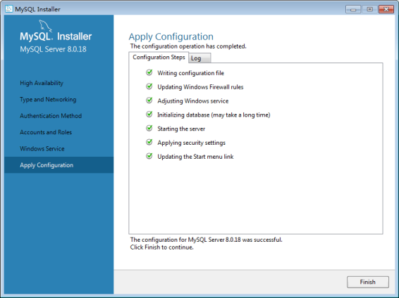

**10.产品配置Product Configuration到此结束：点击Next按钮。**

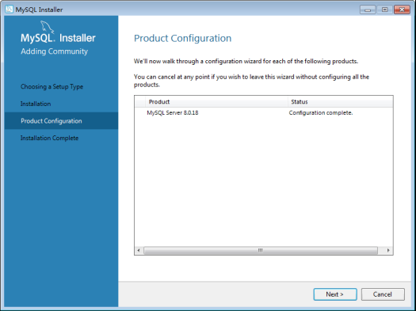

**11.安装完成 Installation Complete。点击Finish按钮完成安装。**

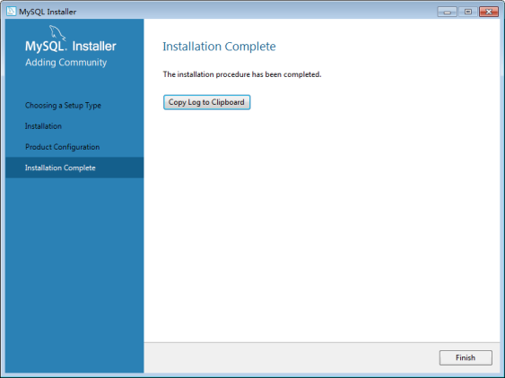


## 【4】MySQL配置、登录

**【1】登录：**
访问MySQL服务器对应的命令：mysql.exe ,位置：C:\Program Files\MySQL\MySQL Server 8.0\bin


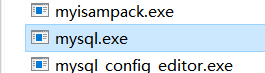


（mysql.exe需要带参数执行，所以直接在图形界面下执行该命令会自动结束）


打开控制命令台：win+r:

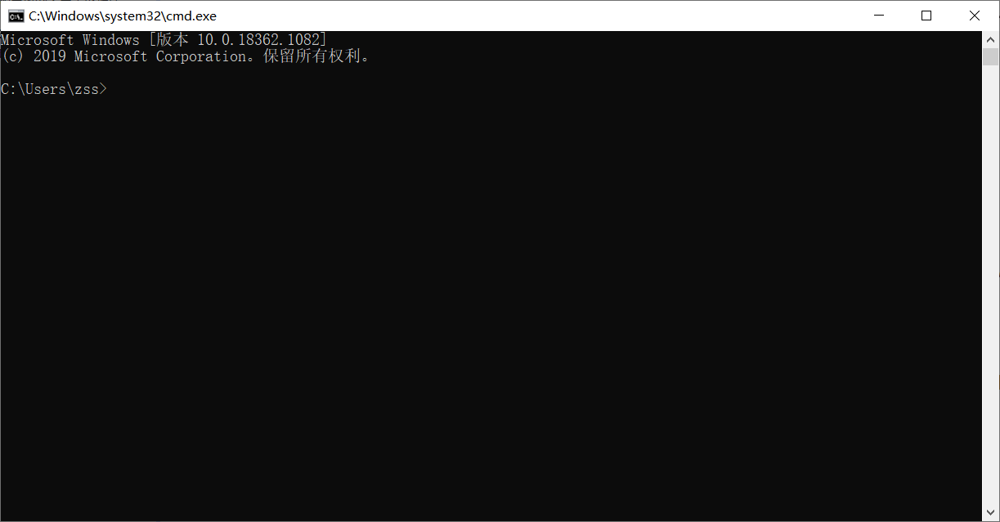

执行mysql.exe命令的时候出现错误：


需要配置环境变量path:

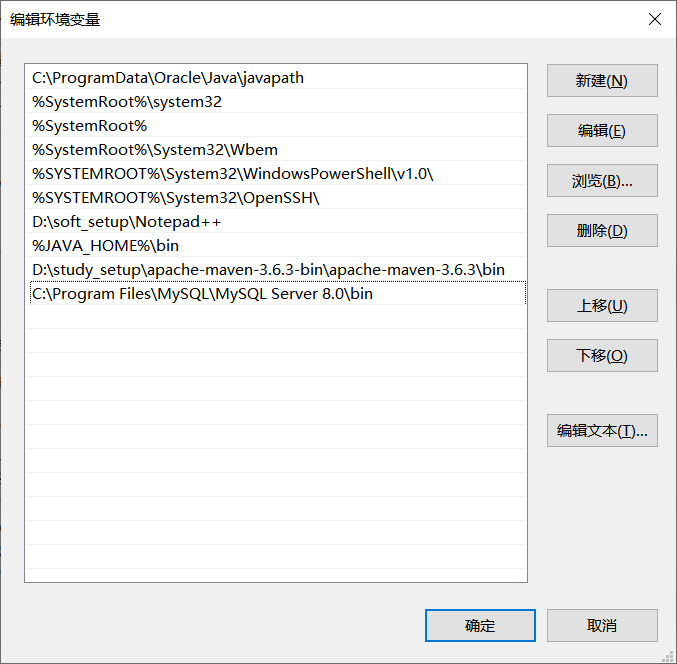

**注意：控制命令台必须重启才会生效：**

**登录的命令：mysql  -hlocalhost -uroot –p**

* mysql：bin目录下的文件mysql.exe。mysql是MySQL的命令行工具，是一个客户端软件，可以对任何主机的mysql服务（即后台运行的mysqld）发起连接。

* -h：host主机名。后面跟要访问的数据库服务器的地址；**如果是登录本机，可以省略**

* -u：user 用户名。后面跟登录数据的用户名，第一次安装后以root用户来登录，是MySQL的管理员用户

* -p:   password 密码。一般不直接输入，而是回车后以保密方式输入。 

    

    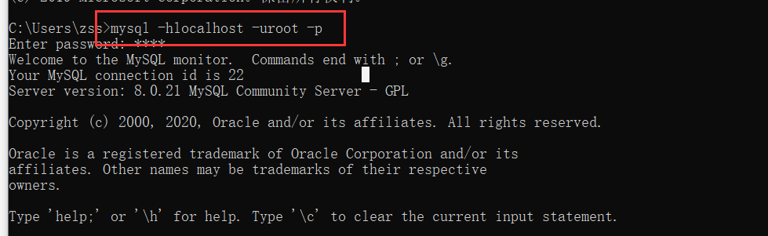


**【2】访问数据库**

显示MySQL中的数据库列表：

```shell
show databases;
```

 默认有四个自带的数据库，每个数据库中可以有多个数据库表、视图等对象。

切换当前数据库的命令：

```shell
use mysql;
```

* MySQL下可以有多个数据库，如果要访问哪个数据库，需要将其置为当前数据库。

* 该命令的作用就是将数据库mysql（默认提供的四个数据库之一的名字）置为当前数据库

显示当前数据库的所有数据库表：

```shell
show tables;
```

MySQL 层次：不同项目对应不同的数据库组成 - 每个数据库中有很多表  - 每个表中有很多数据

**【3】退出数据库**

退出数据库可以使用quit或者exit命令完成，也可以用\q;  完成退出操作


## 【5】卸载

**1)停止MySQL服务：在命令行模式下执行net stop mysql或者在Windows服务窗口下停止服务**

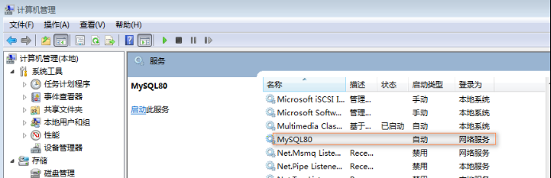

**2)在控制面板中删除MySQL软件**

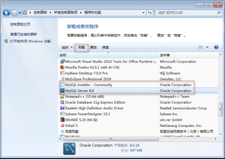

**3)删除软件文件夹：直接删除安装文件夹C:\Program Files\MySQL，其实此时该文件夹已经被删除或者剩下一个空文件夹。**

**4)删除数据文件夹：直接删除文件夹C:\ProgramData\MySQL。此步不要忘记，否则会影响MySQL的再次安装。**
**（ProgramData文件夹可能是隐藏的，显示出来即可）**
**（MySQL文件下的内容才是真正的MySQL中数据）**

**5)删除path环境变量中关于MySQL安装路径的配置** 