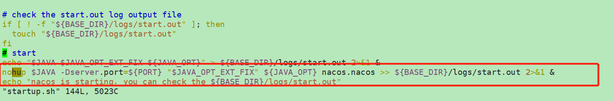
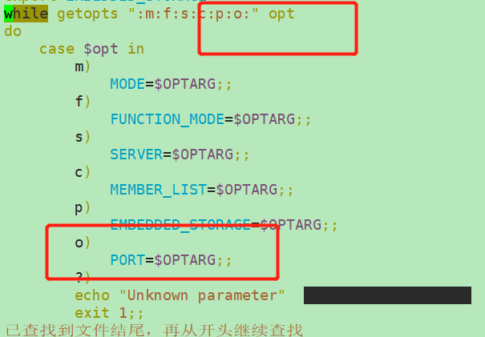
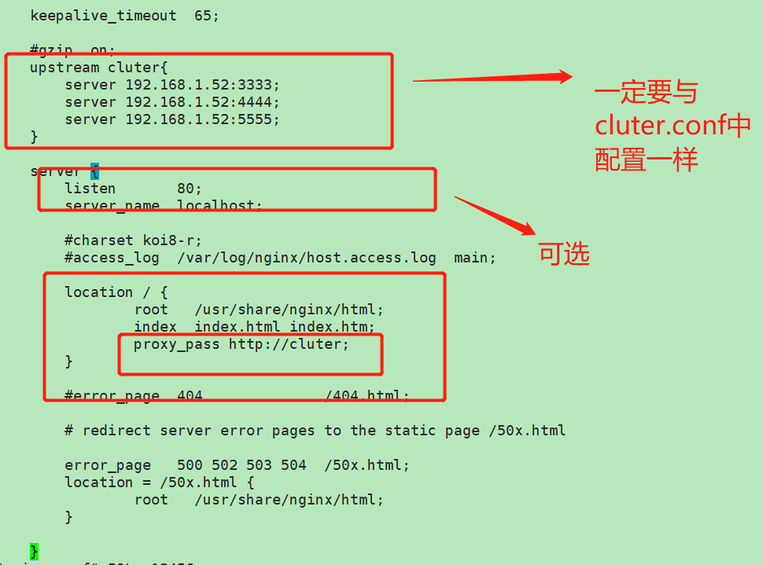

# Nacos集群配置

* 前提

> 1、安装  [jdk](#jdk_install)
>
> 2、安装之前必须 配置  [mysql5.6.+](#mysql_install)
>
> 3、配置 [nginx](#nginx_install_1)
>
> 4、配置 [Nacos（单机版-1）](#nacos_install_1)

* 懒加载

> 我们启动nginx之后可能不会立即开始代理，打开日志等一会，没有结果的时候重配一下


## ——1

​	* 此例中  `nginx:1.16` 安装教程为： [Nacos（单机版-1）](#nacos_install_1)

### 1、修改集群配置文件

​	这里开始正式配置集群，首先我们要更改   **cluter.conf**   这个配置文件，当然我们也需要备份，但是这里它的**原始名称**为：**cluster.conf.example** ，我们需要把它保留同时复制出一个cluster.conf来进行更改

```shell
cd /usr/local/nacos/conf

# 先备份
cp cluster.conf.example cluster.conf

```

修改cluster.conf

```shell
# 格式： ip地址:端口号
#
# Copyright 1999-2018 Alibaba Group Holding Ltd.
#
# Licensed under the Apache License, Version 2.0 (the "License");
# you may not use this file except in compliance with the License.
# You may obtain a copy of the License at
#
#      http://www.apache.org/licenses/LICENSE-2.0
#
# Unless required by applicable law or agreed to in writing, software
# distributed under the License is distributed on an "AS IS" BASIS,
# WITHOUT WARRANTIES OR CONDITIONS OF ANY KIND, either express or implied.
# See the License for the specific language governing permissions and
# limitations under the License.
#

#it is ip
#example
#192.168.16.101:8847
#192.168.16.102
#192.168.16.10

#ip:port
192.168.124.133:3333
192.168.124.133:4444
192.168.124.133:5555
```

### 2、编辑Nacos的启动脚本startup.sh

```shell
cd /usr/local/nacos/bin

# 先备份
cp startup.sh starup.sh.bk
vim  startup.sh 

```


```shell
#1  在while 的变量中添加 o 并且在case 中添加对应处理
        o)
            PORT=$OPTARG;;
        
#2  在nohup 和"$JAVA_OPT_EXT_FIX"之前配置这个
     $JAVA -Dserver.port=${PORT}  
 
```






### 3、配置nginx

```shell
    
    upstream  cluster{
	server 192.168.1.52:3333;
	server 192.168.1.52:4444;
	server 192.168.1.52:5555;
    }

	proxy_pass  http://cluter;
```

**图片中 `cluster`写错了 少了一个`s` ，其实问题也不大，但是要专业~~**




### 4、启动Nginx

```shell

```

### 5、查看测试

http://192.168.1.52:80/nacos