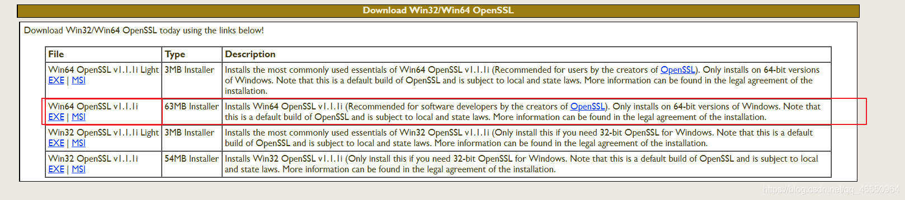
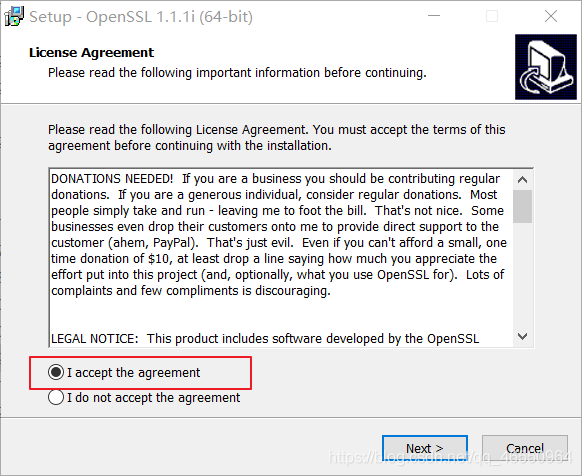
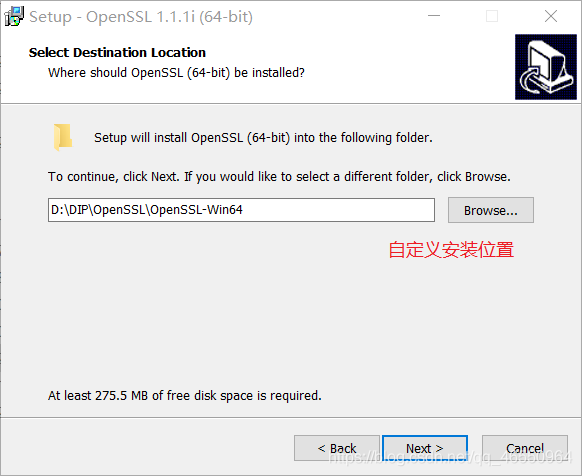
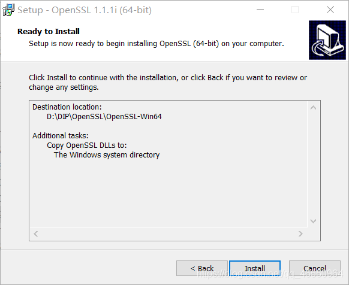
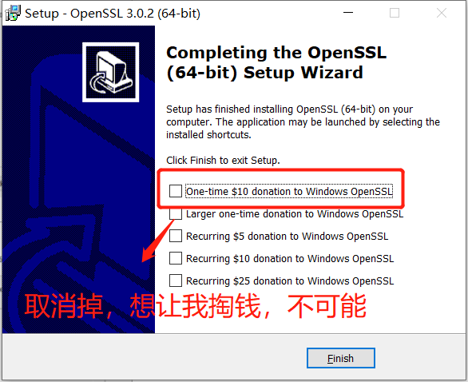
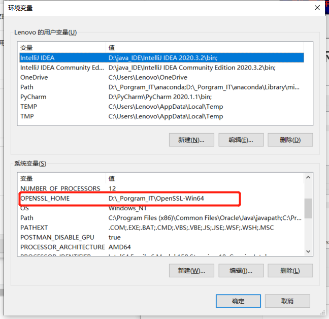
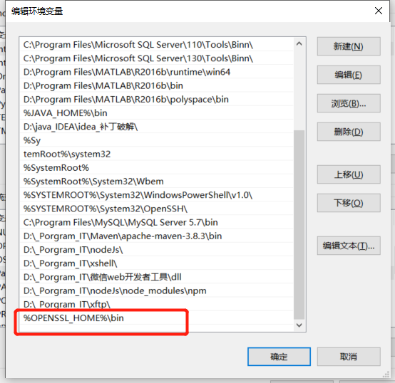

# OpenSSL安装教程

openssl官网下载地址：http://slproweb.com/products/Win32OpenSSL.html


## 安装环境:

>windows 10
>Win64 OpenSSL v1.1.1i


## 一.下载openssl安装版

​	我这里是win10 64位,所以选的中间那个

 


## 二.安装过程

​	也没啥特殊的 ，一直next，只有两点注意：

1、修改安装地址

2、最后一步，不要勾选，会掏钱。

  

  

  

  



## 三.配置环境变量



 


## 四.测试

```sh
openssl -version
```


