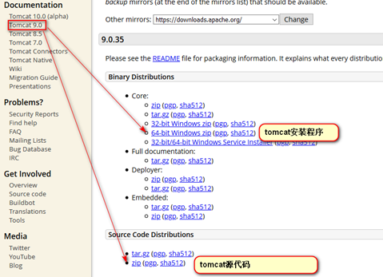

# Tomcat安装

下载

下载地址：http://tomcat.apache.org/

## 安装

tomcat由apache开源组织使用java开发的一款web容器,在使用之前需要安装JDK及配置JAVA_HOME.Tomcat是绿色软解，**解压就可使用**。如果之前已经安装了其他tomcat并且还配置了CATALINA_HOME 不要忘记修改CATALINA_HOME指向我们现在使用的这个tomcat

## Tomcat启动

运行startup.bat文件。

一定要配置JAVA_HOME   C:\Program Files\Java\jdk1.8.0_161
部分电脑需要配置CATALINA_HOME   D:/***/***/apache-tomcat-9.0.41
记住一个习惯:以后我们装任何一个软件路径都应该避免中文,空格和特殊符号,可以使用_

## Tomcat关闭

  运行shutdown.bat文件或者直接关闭掉启动窗口。

## 访问Tomcat

访问Tomcat的URL格式：http://ip:port

访问本机Tomcat的URL格式：http://localhost:8080